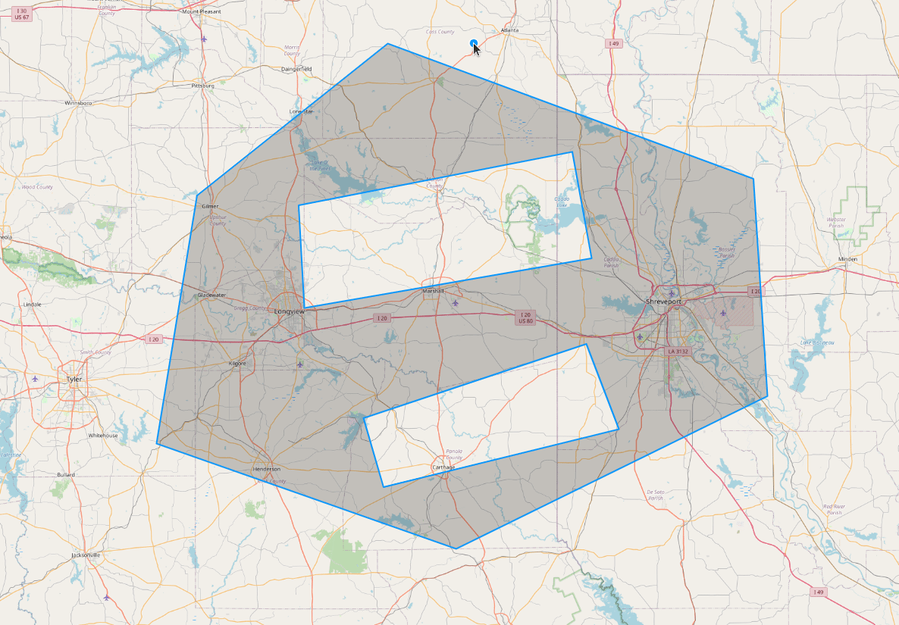

# OpenLayersPolygonWithHolesSplit
Split a polygon geometry with holes by a line in OpenLayers

## For tutorial post, click on following link 
[Split a Polygon with holes by Line in OpenLayers](https://spatial-dev.guru/2021/12/25/split-a-polygon-with-holes-by-line-in-openlayers/ "")
